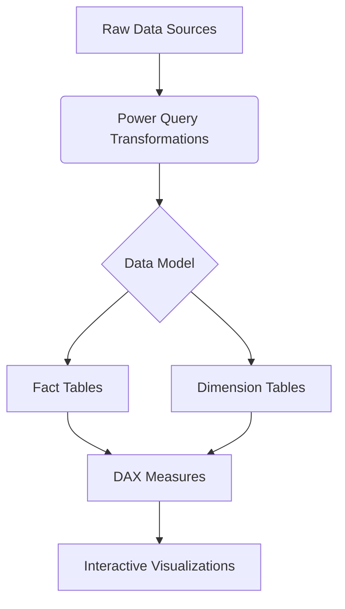
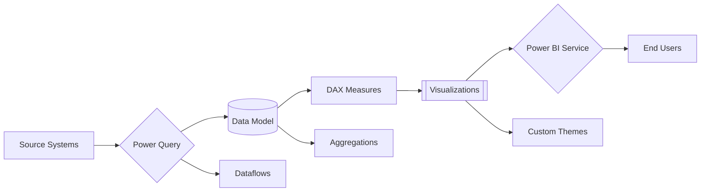

# BUSINESS SALES DASHBOARD FROM E COMMERCE DATA
## Future Data Solutions (FUTURE_DS_01)


## 📌 Project Overview
**Future Data Solutions (FUTURE_DS_01)** is the inaugural Power BI project developed under the **Future Interns Internship Program**. This professional analytics solution demonstrates industry-standard data visualization and business intelligence capabilities.

```diff
+ Key Highlights:
- Designed as the first milestone project for Future Interns
- Implements enterprise-grade Power BI techniques
- Combines educational value with real-world application
```

## 📊 Dashboard Preview!


# Technical Specifications

## 🖥️ System Requirements

| Component          | Minimum Requirements               | Recommended                   |
|--------------------|------------------------------------|-------------------------------|
| **Power BI**       | Version 2.104.583.0 (2023)         | Latest stable release         |
| **RAM**           | 4GB                                | 8GB+                          |
| **Storage**       | 500MB free space                   | 1GB SSD                       |
| **OS**            | Windows 10/11                      | Windows 11                    |

## 🚀 Features
### Core Functionalities
#### Interactive Dashboards
- Cross-filtering and highlighting
- Drill-through capabilities
- Bookmarks for navigation

#### Advanced Analytics


## 👨‍💻 Internship Learning Objectives
Through this project, Future Interns will:
- Master Power BI's core functionality
- Develop professional data modeling skills
- Learn to create production-ready reports
- Understand best practices for enterprise BI
- Gain experience with version control for BI projects

## 📊 Project Significance
As the foundational project for Future Interns, FUTURE_DS_01 serves as:
- A hands-on introduction to enterprise BI development
- A framework for understanding end-to-end analytics solutions
- A portfolio piece demonstrating real-world Power BI skills
- The baseline for more advanced internship projects

# 🛠️ Technical Stack Documentation

## Core Components

### Business Intelligence Platform
| Component           | Technology                          | Version  |
|---------------------|-------------------------------------|----------|
| BI Development Tool | Microsoft Power BI Desktop          | 2.124.xxx|
| Cloud Service       | Power BI Service                    | -        |
| Mobile Viewer       | Power BI Mobile Apps                | -        |

### Data Processing Layer
| Component           | Technology                          | Usage                          |
|---------------------|-------------------------------------|--------------------------------|
| ETL Engine          | Power Query (M Language)            | Data extraction & transformation |
| Dataflow Processor  | Power BI Dataflows                  | Reusable data pipelines        |
| Gateway             | On-premises Data Gateway            | Enterprise data connectivity   |

### Analytics Engine
| Component           | Technology                          | Key Features                   |
|---------------------|-------------------------------------|--------------------------------|
| Calculation Engine  | DAX (Data Analysis Expressions)     | 50+ custom measures           |
| Time Intelligence   | DAX Time Patterns                   | YTD, QTD, MTD calculations    |
| Advanced Analytics  | Python/R Integration                | Predictive models             |

### Data Storage & Modeling
| Component           | Technology                          | Implementation                |
|---------------------|-------------------------------------|--------------------------------|
| Data Model          | Star Schema                         | Optimized relationships       |
| Storage Mode        | Import/DirectQuery Hybrid           | Balance of performance & freshness |
| Aggregations        | Power BI Aggregations               | Large dataset optimization    |

### Visualization Framework
| Component           | Technology                          | Usage                          |
|---------------------|-------------------------------------|--------------------------------|
| Core Visuals        | Power BI Native Visuals             | 20+ chart types               |
| Custom Visuals      | Power BI Marketplace                | Advanced visualizations       |
| Theme Engine        | JSON-based Themes                   | CY24SU10, Storm themes        |

### Development Ecosystem
| Component           | Technology                          | Usage                          |
|---------------------|-------------------------------------|--------------------------------|
| Version Control     | Git/GitHub                          | Source code management        |
| CI/CD               | GitHub Actions/Power BI Pipelines   | Automated deployment          |
| Documentation       | Markdown                            | Project documentation         |
| Issue Tracking      | GitHub Issues                       | Bug/feature tracking          |

## System Architecture



## 🤝 Contributing
We welcome contributions from Future Interns participants:
- Fork the repository
- Create your feature branch (git checkout -b feature/AmazingFeature)
- Commit your changes (git commit -m 'Add some AmazingFeature')
- Push to the branch (git push origin feature/AmazingFeature)
- Open a Pull Request


## 📜 License
MIT License
- Copyright (c) 2025 Future Data Solutions
